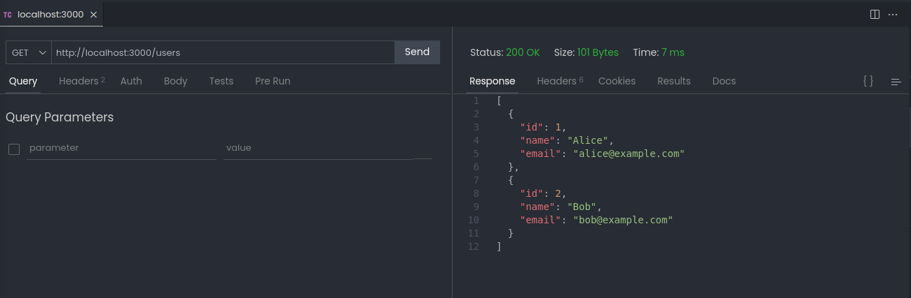
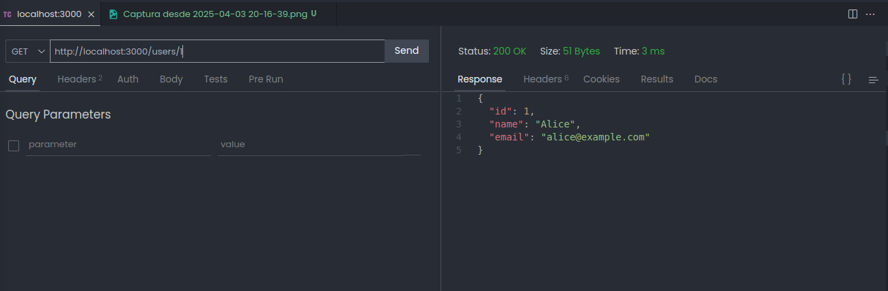

# Integrantes equipo:

- Nicolas Calvo
- Mauricio Moraga
- Henry Saldaña
- Claudia Ortiz

# Proyecto TechFlow

Este proyecto muestra una API básica de Node.js para gestionar usuarios, integrada con Docker para la contenerización y Jenkins para el pipeline de CI/CD.

## Capacidades de la API

- Listar todos los usuarios
- Obtener un usuario por ID

## Correr de manera local

1. Instalar dependencias: `npm install`
2. Correr el servidor: `npm start`
3. Correr las pruebas: `npm test`

## Screenshot de la API

## Correr con Docker

1. Construir la imagen: `docker build -t techflow-api .`
2. Correr el contenedor: `docker run -p 3000:3000 techflow-api`

## Pipeline de CI/CD

El pipeline de CI/CD está configurado en Jenkins y realiza las siguientes etapas:

- [Acceso a Pipeline utilizada](Jenkinsfile)
- [Acceso a reporte de pruebas generado](Reporte/3.txt)
